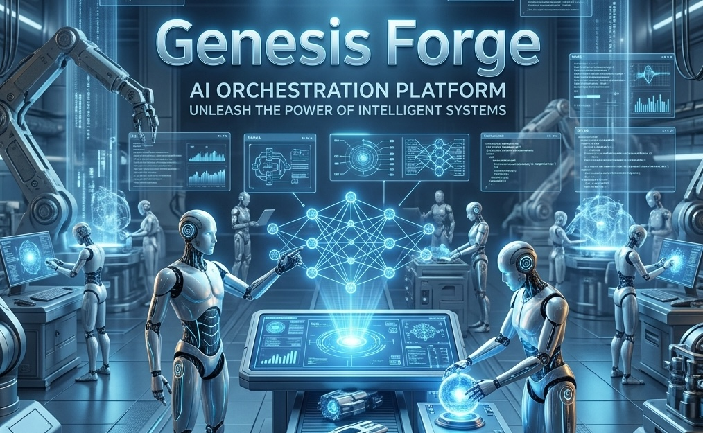

# Genesis Forge



> **Multi-agent AI Orchestration Provider** — 24 specialist agents, 90 skills, and 13 automated workflows for Gemini and Claude CLIs.

[](https://npmjs.com/package/genesis-forge)
[](https://www.npmjs.com/package/genesis-forge)
[](./LICENSE)
[](https://nodejs.org)

---

## ✦ What is Genesis Forge?

Genesis Forge is a portable library of AI expertise. It is designed to work **inside** your existing AI CLI environments (`gemini-cli`, `claude-code`, `cline`, etc.) rather than as a standalone tool.

- **24 Specialist Agents**: Persona-driven experts (Frontend, Backend, Security, DevOps, etc.).
- **90 Skill Modules**: Structured knowledge for 23 domains (React, k8s, OWASP, etc.).
- **13 Automated Workflows**: Slash-command style workflows like `/debug`, `/create`, `/orchestrate`.
- **Integrated Routing**: Deterministic logic to pick the right agent and skill for any task.
- **MCP Native**: Exposes all skills as tools for MCP-compatible clients (Claude, Cline).

---

## 🚀 Installation & Setup

### 1. Global Installation (Recommended)
Install the CLI once to have the `genesis-forge` command available everywhere:

```bash
npm install -g genesis-forge
genesis-forge setup
```

To remove the integrations later:
```bash
genesis-forge remove
```

### 2. Using via npx
Alternatively, run it without installing:

```bash
npx genesis-forge setup
# or to remove
npx genesis-forge remove
```

This command will:
1. Detect your `~/.gemini/` and `~/.claude.json` configuration.
2. Automate the symlinking of rules and MCP server configuration.
3. Clean up and remove integrations when using the `remove` command.

---

## 🤖 Integration Modes

### 1. Google Gemini CLI (`gemini-cli`)
Gemini CLI uses **rules files** to power its logic. Genesis Forge provides a master rules file:

**Manual Setup:**
```bash
ln -s agent/rules/GEMINI.md ~/.gemini/GEMINI.md
```
Once linked, the Gemini CLI will automatically use Genesis Forge's routing and skill discovery logic.

### 2. Anthropic Claude CLI (`claude-code`) / Cline
Claude-based tools use the **Model Context Protocol (MCP)** to discover dynamic tools.

**Manual Setup:**
1. Start the MCP server: `genesis-mcp` (or `npx genesis-mcp`)
2. Add the above command to your `claude-code` or `cline` configuration file.
3. Claude will now see `skill_search`, `route_task`, and `get_skill_registry` as native tools.

---

## 📦 Using as an NPM Library

You can also use the kit's core data structure in your own Node.js projects:

```javascript
import { KIT_ROOT, SKILLS_DIR, getSkillPath } from 'genesis-forge';

console.log(`Kit root: ${KIT_ROOT}`);
console.log(`Skills: ${SKILLS_DIR}`);
```

---

## 📋 Available Agents & Workflows

| Agent | Specialization | Workflow | Description |
|-------|----------------|----------|-------------|
| `orchestrator` | Multi-agent coordination | `/orchestrate` | Complex task breakdown |
| `frontend-specialist` | React, Vue, Next.js, UI/UX | `/create` | Component & feature building |
| `debugger` | Root cause analysis | `/debug` | Deep debugging & fixing |
| `security-auditor` | OWASP, auth, compliance | `/test` | Security auditing |
| `project-planner` | Discovery & task planning | `/plan` | Implementation roadmaps |

---

## ⚙️ How It Works

Genesis Forge is a **pure data provider** — no API keys needed.

1. **Your CLI handles auth** (Gemini CLI, Claude CLI, etc.)
2. **Genesis Forge provides** agents, skills, and workflows
3. **Routing is local** — no external API calls

Build the skill registry after adding new skills:
```bash
python3 agent/scripts/build_skill_registry.py
```

---

## 🛠️ Requirements

- **Node.js** >= 18.0.0
- **Python 3** >= 3.8 (required for core routing scripts)

---

## 📄 License

MIT — see [LICENSE](./LICENSE)
